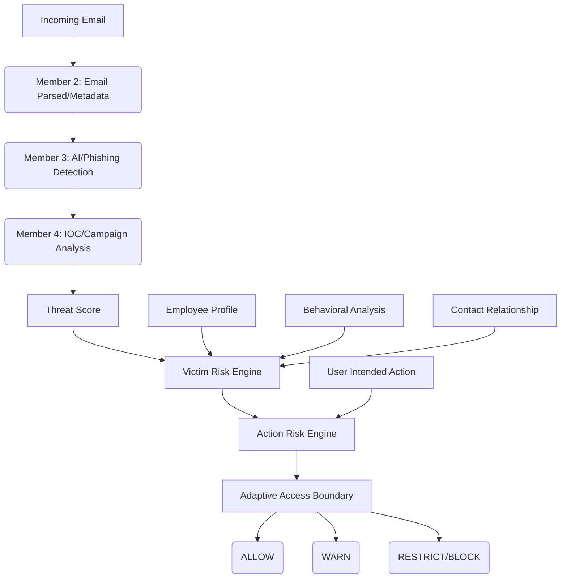

# 🛡️ PHISHSHIELD — MEMBER 5 DOCUMENTATION

## 🏛️ Member 5 Architecture

The Member 5 module focuses on **Victim-Aware Risk Scoring** and an **Adaptive Email Access Boundary**. It shifts the perspective from simply evaluating an email's threat level to understanding the contextual risk of the email to a specific employee and determining whether the user's intended actions should be permitted.

### Architecture Diagram


## 🧮 Risk Formula

### 1. Exposure Score
Calculated based on an employee's access and privilege level:
```python
score = (privilege_level * 1.5) + (system_access * 1.2) + (financial_access * 1.5) + (administrative_access * 1.3) + (data_sensitivity * 1.5)
exposure = min((score / 70.0) * 100, 100)
```

### 2. Business Impact Score
Calculated based on the potential impact if the employee is compromised:
```python
score = (business_criticality * 2.0) + (financial_access * 1.5) + (data_sensitivity * 1.5) + (administrative_access * 1.0)
impact = min((score / 60.0) * 100, 100)
```

### 3. Victim Risk Score
Combines the upstream threat score with the employee's exposure and business impact:
```python
victim_risk = (threat * 0.4) + (exposure * 0.3) + (impact * 0.3)
```

## 📊 Risk Thresholds
Consistent risk level classification applied across the module:
- **0–29:** LOW
- **30–59:** MEDIUM
- **60–84:** HIGH
- **85–100:** CRITICAL

## 👤 Employee Profile Model
Employees are modeled with security-centric attributes (scaled 1-10):
- `employee_id`: Unique identifier
- `role`, `department`: Organization details
- `privilege_level`: IT/System privilege
- `system_access`: Access to internal systems
- `financial_access`: Ability to execute or approve financial transactions
- `administrative_access`: Access to administrative systems
- `data_sensitivity`: Sensitivity of data regularly handled
- `business_criticality`: Impact of downtime or compromise on core business functions

## 📈 Behavioral Model
Analyzes user behavior against a baseline to detect anomalies that might indicate an account compromise.
- Evaluates: `normal_start_hour`, `normal_end_hour`, `average_daily_emails`.
- Compares against `current_volume` and sending times.
- Detects `UNUSUAL_SENDING_TIME` and `ABNORMAL_EMAIL_VOLUME`.

## 🤝 Contact Model
Evaluates risk based on relationship history:
- Determines if the contact is `is_new_contact`.
- Uses `interaction_count` and `relationship_strength` (`UNKNOWN`, `WEAK`, `NORMAL`, `STRONG`).
- Higher base risk is assigned to new contacts and contacts from unknown domains.

## ⚙️ Action Risk Model
Risk is not static; it depends on what the user wants to do. 
```python
action_risk = (victim_risk * 0.4) + (action_sensitivity * 0.6)
# Additional non-linear scaling applied for high victim risk + high action sensitivity.
```
Action Sensitivities:
- `READ`: 10.0
- `REPLY`: 30.0
- `FORWARD`: 40.0
- `CLICK_URL`: 70.0
- `DOWNLOAD_ATTACHMENT`: 75.0
- `ENTER_PASSWORD` / `ENTER_OTP` / `SUBMIT_CREDENTIALS`: 95.0
- `MAKE_PAYMENT`: 100.0

## 🛡️ Access Policy
Backend enforcement policy based on the calculated `action_risk`:
- **LOW (< 30):** ALLOW
- **WARN (< 60):** ALLOW (WARN for sensitive actions like ENTER_PASSWORD)
- **RESTRICT (< 85):** BLOCK for sensitive actions, RESTRICT for URL/Downloads, WARN otherwise
- **BLOCK (>= 85):** BLOCK all actions (READ may be restricted)

## 🔗 API Endpoints

### Employees
- `POST /api/employees`: Create employee
- `GET /api/employees`: List employees
- `GET /api/employees/{employee_id}`: Get employee
- `PUT /api/employees/{employee_id}`: Update employee
- `DELETE /api/employees/{employee_id}`: Delete employee
- `GET /api/employees/{employee_id}/risk-profile`: Get employee exposure/impact profile

### Risk & Access
- `POST /api/risk/evaluate`: Evaluate comprehensive victim risk for an email
- `POST /api/risk/action`: Evaluate the risk of a specific action
- `POST /api/access/evaluate`: Get final access decision for an action

## 🔌 Integration with Members 1–4
Member 5 uses `threat_intel_adapter.py` to seamlessly pull data from the existing database populated by Members 2–4.
1. It queries the `Incident` table (Member 2).
2. It extracts `phishing_probability` from `metadata_json` (Member 3).
3. It queries the `IOC` table and `Campaign` relationships for reputation scores (Member 4).
4. The frontend (Member 1) calls Member 5 APIs to retrieve the final access decision and risk context.
